# Skill Swap Hub — Backend API

Skill Swap Hub is a robust, peer-to-peer skill exchange platform backend built with **Java 21**, **Spring Boot 3.5**, and **PostgreSQL**.

The platform enables users to trade knowledge in three modes: **swap skills** (mutual exchange), **teach for free**, or **teach for a price**. It provides profile management, sophisticated scheduling with multi-tier conflict detection, real-time messaging, WebRTC video/voice call signaling, mutual session reviews, and administrator dashboard controls.

---

## Entity-Relationship (ER) Diagram

Below is the database schema model mapping the relationship between users, sessions, chats, reports, and other entities:

```mermaid
erDiagram
    User ||--o{ UserSkill : "registers"
    User ||--o{ Availability : "defines"
    User ||--o{ Session : "participates"
    User ||--o{ Feedback : "submits/receives"
    User ||--o{ ChatMessage : "sends/receives"
    User ||--o{ Notification : "receives"
    User ||--o{ Report : "files/gets reported"
    User ||--o{ Certification : "has"
    User ||--o{ Experience : "possesses"
    User ||--o| RefreshToken : "owns"

    Session ||--o{ Feedback : "reviewed by"

    User {
        UUID id PK
        String email UK
        String password
        String firstName
        String lastName
        String bio
        String profilePictureUrl
        String role
        Double averageRating
        Integer totalSessions
        LocalDateTime createdAt
    }

    UserSkill {
        UUID id PK
        UUID userId FK
        String skillName
        String proficiency "BEGINNER/INTERMEDIATE/ADVANCED"
        String direction "TEACH/LEARN"
        String preferredMode "SWAP/FREE/PAID/ANY"
        BigDecimal hourlyRate
    }

    Availability {
        UUID id PK
        UUID userId FK
        Integer dayOfWeek "1=MON to 7=SUN"
        LocalTime startTime
        LocalTime endTime
        String timezone
    }

    Session {
        UUID id PK
        UUID teacherId FK
        UUID studentId FK
        String skillName
        String billingType "SWAP/FREE/PAID"
        BigDecimal price
        UUID swapSessionId FK
        LocalDateTime startTime
        LocalDateTime endTime
        String status "PENDING/ACCEPTED/REJECTED/COMPLETED/CANCELLED"
        String virtualRoomUrl
        String cancelReason
        LocalDateTime createdAt
    }

    Feedback {
        UUID id PK
        UUID sessionId FK
        UUID reviewerId FK
        UUID revieweeId FK
        Integer rating "1 to 5"
        String comment
        LocalDateTime createdAt
    }

    ChatMessage {
        UUID id PK
        UUID senderId FK
        UUID receiverId FK
        String content
        String attachmentUrl
        String messageType "TEXT/IMAGE/FILE/CALL"
        Boolean isRead
        LocalDateTime sentAt
    }

    Notification {
        UUID id PK
        UUID userId FK
        String title
        String message
        String type "SESSION_REQUEST/SESSION_ACCEPTED/SESSION_REJECTED/SESSION_CANCELLED/SESSION_COMPLETED/NEW_MESSAGE/FEEDBACK_RECEIVED/SYSTEM"
        String referenceId
        Boolean isRead
        LocalDateTime createdAt
    }

    Report {
        UUID id PK
        UUID reporterId FK
        UUID reportedUserId FK
        String reason "SPAM/HARASSMENT/INAPPROPRIATE/OTHER"
        String description
        String status "PENDING/REVIEWED/DISMISSED/ACTION_TAKEN"
        LocalDateTime createdAt
    }

    Certification {
        UUID id PK
        UUID userId FK
        String name
        String issuingOrganization
        LocalDate issueDate
        LocalDate expiryDate
        String credentialId
        String credentialUrl
    }

    Experience {
        UUID id PK
        UUID userId FK
        String title
        String organization
        String description
        LocalDate startDate
        LocalDate endDate
        String type "TEACHING/PROFESSIONAL/PROJECT/ACHIEVEMENT"
    }

    RefreshToken {
        UUID id PK
        UUID userId FK
        String token UK
        Instant expiryDate
    }
```



---

## Important Features & Architectural Highlights

### 1. Booking & Conflict Detection Engine
The `SessionService` enforces a strict 7-step validation workflow before committing any session booking:
1. **Self-Booking Check**: Prevents users from booking sessions with themselves.
2. **Time Range Check**: Enforces that the end time is chronologically after the start time, and that the slot is booked in the future.
3. **Teacher Skill Check**: Verifies that the requested teacher has registered the target skill with the direction `TEACH`.
4. **Student Skill Check**: Verifies that the student has the target skill listed under the direction `LEARN`.
5. **Availability Coverage**: Checks that the requested start and end times fall strictly within one of the teacher's registered `Availability` intervals for that day of the week.
6. **Teacher Overlaps**: Queries the database to verify the teacher has no existing accepted or pending sessions overlapping the requested time slot.
7. **Student Overlaps**: Queries the database to ensure the student does not have any overlapping sessions scheduled.

### 2. Real-Time WebSocket Infrastructure
- **Messaging (STOMP)**: Utilizes Spring WebSocket and STOMP protocols (`/topic/messages`, `/topic/notifications`) for lightweight sub-second message exchanges and immediate push alerts.
- **WebRTC Signaling Gateway**: Serves as a signaling mechanism (via the `/app/call/signal` socket route) to bridge peer-to-peer video/voice connections. It relays RTC session descriptions (offers/answers) and ICE candidates between clients without storing streaming media on the backend.
- **Virtual Meeting Classrooms**: Automatically generates a unique Jitsi Meet room link (`https://meet.jit.si/skillswap-{sessionId}`) on session confirmation, allowing zero-setup virtual call classrooms.

### 3. Asynchronous Auditing & Dynamic Statistics
- **Feedback & Rating Engine**: When feedback is submitted, the backend triggers database triggers/hooks to compute the target user's updated average rating dynamically.
- **Session Accounting**: Completing a session automatically triggers an update to the total completed sessions count for both the teacher and the student, boosting profile credibility metrics.
- **Automatic Token Rotation**: Implements secure cookie or payload token delivery. Once a refresh token is verified, the system purges any expired or duplicate sessions.

---

## Tech Stack

| Layer | Technology | Description |
|---|---|---|
| **Language** | Java 21 | Utilizes modern Java features (records, virtual threads configuration compatibility). |
| **Framework** | Spring Boot 3.5 | Spring MVC, Spring Data JPA, Spring Security, Spring WebSocket. |
| **Build System** | Maven | Managed dependencies and build pipelines. |
| **Database** | PostgreSQL 16 | Relational store with index optimizations on foreign keys. |
| **Caching/Security** | Spring Security + JWT | Stateless session controls with HMAC-SHA256 tokens. |
| **Real-time Layer** | Spring WebSocket (STOMP) | Interactive chat and system message relays. |
| **APIs Documentation**| SpringDoc OpenAPI | Automated OpenAPI specification and Swagger UI interactive console. |
| **Testing** | JUnit 5 + Mockito + H2 | Isolated testing utilizing mockito decorators and lightweight unit contexts. |

---

## Quick Start

### Prerequisites
- Java 21 SDK
- Docker & Docker Compose (for running PostgreSQL locally)

### 1. Spin Up PostgreSQL Local Instance
```bash
docker-compose up -d
```

### 2. Set Up Environment Variables
Copy the template variables file and customize it:
```bash
cp .env.example .env
```
Fill in the database configuration, JWT secrets, and Google Client IDs.

### 3. Run Application
Run the Maven spring-boot launcher:
```bash
./mvnw spring-boot:run
```

### 4. Interactive Swagger Console
Open your browser and navigate to:
[http://localhost:8080/swagger-ui.html](http://localhost:8080/swagger-ui.html)

---

## Testing

The project has a comprehensive unit testing suite consisting of **139 tests** covering all service layers, validation handlers, scheduling conflicts, JWT expirations, and WebSocket notifications.

To clean and run the test suite:
```bash
./mvnw clean test
```

---

## API Modules

| Module | Base Path | Key Features |
|---|---|---|
| **Auth** | `/api/auth` | Register, login, oauth2 google sign-in, token refresh, logout. |
| **Users** | `/api/users` | Profile retrieval, partial profile updates, search by skills. |
| **Skills** | `/api/skills` | Register skills with directions (TEACH/LEARN) and billing mode preferences. |
| **Certifications**| `/api/certifications` | Manage credentials, certification verification IDs, links. |
| **Experiences** | `/api/experiences` | Add professional/educational experiences. |
| **Availability** | `/api/availabilities` | Register weekly teaching availability slots. |
| **Sessions** | `/api/sessions` | Booking, teacher acceptance/rejections, session completion, and cancellation. |
| **Feedback** | `/api/feedback` | Submit session ratings and reviews. |
| **Chat** | `/api/chat` | Send 1-to-1 messages, list conversations, mark chats as read. |
| **Notifications** | `/api/notifications`| Manage notification alerts and unread counts. |
| **Reports** | `/api/reports` | Submit reports against users for platform moderation. |
| **Admin** | `/api/admin` | Ban/unban users, review reports, check platform stats. |
